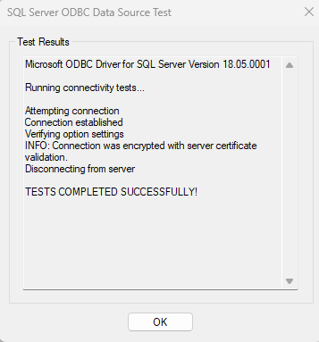

# Source Connector for Azure Synapse Analytics

This guide describes how to configure Digna to connect to Azure Synapse Analytics using either the native Python connector or the ODBC driver.
It supports both serverless and dedicated SQL pools.

It refers to the screen **"Create a Database Connection"**.


---

## Native Python Driver

**Library:** `pymssql`  
**Supported Authentication:** Password-based authentication only

> ⚠️ For other authentication methods, please use the ODBC driver.

### Digna Configuration (Native Driver)

Provide the following information in the **"Create a Database Connection"** screen:

```
Technology:      MS SQL Server
Host Address:    <synapse-workspace>[-ondemand].sql.azuresynapse.net
Host Port:       Port number, e.g. 1433
Database Name:   Database name
Schema Name:     Schema that contains the source data
User Name:       Database user name
User Password:   Password for the user
Use ODBC:        Disabled (default)
```

---

## ODBC Driver

The ODBC driver may support a broader range of authentication and connectivity options. This section focuses on password-based authentication using the driver **ODBC Driver 18 for SQL Server**.

### 1. Install the ODBC Driver

Install the driver **ODBC Driver 18 for SQL Server** (or similar) by following the vendor’s official installation guide.

### 2. Configure the ODBC Data Source

Follow these steps to configure a new ODBC data source using password-based authentication:

#### Step 1


Fill out the "Server" field.
Use the name of the synapse workspace and extend it with ".sql.azuresynapse.net.   
**Attention**, if you want to connect using a serverless SQL pool, make sure to include "-ondemand" as shown in below screenshot.

Click the **Next >** button.

#### Step 2


Choose the authentication method (e.g. username and password)
and provide the required data.

Click the **Next >** button.

#### Step 3


Choose the ANSI compliant settings then click the **Next >** button.

#### Step 4


You can leave the default settings or choose options as needed 
and click the **Finish** button. 

#### Step 5


Now click the ** Test datasource ** button.

#### Step 6


When you receive the success screen, ODBC is configured properly.

---

Now you can configure Digna to use the ODBC connection, either with a **DSN (Data Source Name)** or a **DSN-less** setup.

---

### A. DSN-Based Configuration

#### Digna Configuration

In the **"Create a Database Connection"** screen, provide the following:

```
Technology:      MS SQL Server
Database Name:   Database that contains the source schema
Schema Name:     Schema that contains the source data
Use ODBC:        Enabled
```

#### ODBC Properties

```
name: "DSN",        value: "azure-synopse-serverless-1"
name: "UID",        value: "your database user"
name: "PWD",        value: "your database password"
name: "DATABASE",   value: "name of the database that contains the source data schema"

```

> 🔹 The `DSN` must match the name defined in your ODBC driver configuration.

---

### B. DSN-less Configuration

#### Digna Configuration

In the **"Create a Database Connection"** screen, provide the following:

```
Technology:      MS SQL Server
Database Name:   Schema that contains the source data (same as Schema Name)
Schema Name:     Schema that contains the source data
Use ODBC:        Enabled
```

#### ODBC Properties

```
name: "DRIVER",     value: "ODBC Driver 18 for SQL Server"
name: "SERVER",     value: "<synapse-workspace>[-ondemand].sql.azuresynapse.net"
name: "UID",        value: "your database user"
name: "PWD",        value: "your database password"
name: "DATABASE",   value: "name of the database that contains the source data schema"
```

**Note** regarding the SERVER property:  
Use the name of the synapse workspace and extend it with ".sql.azuresynapse.net. If you want to connect using a serverless SQL pool, make sure to include "-ondemand" as shown in below screenshot.
