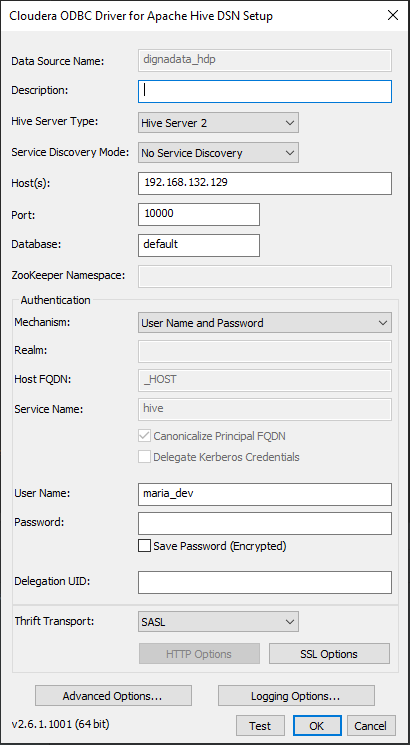
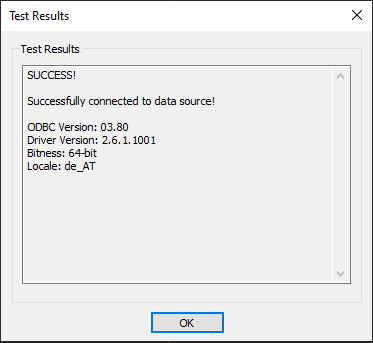

# Source Connector for Hive

This guide describes how to configure Digna to connect to Hive using either the native Python connector or the ODBC driver.

It refers to the screen **"Create a Database Connection"**.


---

## Native Python Driver

**Library:** `PyHive`  
**Supported Authentication:** Password-based authentication only

> ⚠️ For other authentication methods, please use the ODBC driver.

### Digna Configuration (Native Driver)

Provide the following information in the **"Create a Database Connection"** screen:

```
Technology:      Apache Hive
Host Address:    Server name or IP address
Host Port:       Port number, e.g. 10000
Database Name:   Schema that contains the source data
Schema Name:     Schema that contains the source data
User Name:       Database user name
User Password:   Password for the user
Use ODBC:        Disabled (default)
```

---

## ODBC Driver

The ODBC driver may support a broader range of authentication and connectivity options. This section focuses on password-based authentication using the driver **Cloudera ODBC Driver for Apache Hive**.

### 1. Install the ODBC Driver

Install the **Cloudera ODBC Driver for Apache Hive** (or similar) by following the vendor’s official installation guide.

### 2. Configure the ODBC Data Source

Follow these steps to configure a new ODBC data source using password-based authentication:

#### Step 1



#### Step 2 – Test the connection

Provide the password and click **Test** button.



After a successful test, click the **OK** button.

---

Now you can configure Digna to use the ODBC connection, either with a **DSN (Data Source Name)** or a **DSN-less** setup.

---

### A. DSN-Based Configuration

#### Digna Configuration

In the **"Create a Database Connection"** screen, provide the following:

```
Technology:      Apache Hive
Database Name:   Schema that contains the source data (same as Schema Name)
Schema Name:     Schema that contains the source data
Use ODBC:        Enabled
```

#### ODBC Properties

```
name: "DSN",            value: "dignadata_hdp"
name: "PWD",            value: "{your password in curly braces}"
```

> 🔹 The `DSN` must match the name defined in your ODBC driver configuration.

---

### B. DSN-less Configuration

#### Digna Configuration

In the **"Create a Database Connection"** screen, provide the following:

```
Technology:      Apache Hive
Database Name:   Schema that contains the source data (same as Schema Name)
Schema Name:     Schema that contains the source data
Use ODBC:        Enabled
```

#### ODBC Properties

```
name: "DRIVER",     value: "Cloudera ODBC Driver for Apache Hive"
name: "HOST",       value: "your server name or IP address"
name: "PORT",       value: "Port number, e.g. 10000"
name: "Schema",     value: "Schema that contains the source data"
name: "UID",        value: "your hive user'
name: "PWD",        value: "your hive password"
name: "AuthMech",   value: "3"
```
