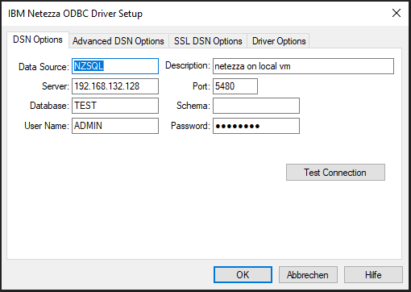
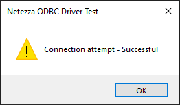

# Source Connector for Netezza

This guide describes how to configure Digna to connect to Netezza using the ODBC driver.

It refers to the screen **"Create a Database Connection"**.


---

## ODBC Driver

The ODBC driver may support a range of authentication and connectivity options. This section focuses on password-based authentication using the driver **NetezzaSQL**.

### 1. Install the ODBC Driver

Install the driver **NetezzaSQL** (or similar) by following the vendor’s official installation guide.

### 2. Configure the ODBC Data Source

Follow these steps to configure a new ODBC data source using password-based authentication:

#### Step 1


Depending on your Netezza driver, setup and security requirements, you may need to also provide data in the tabs **Advanced DSN Options**, **SSL DSN Options** or **Driver Options**. For the simple most setup it is sufficient to provide data in **DSN Options**.

Click the **Test Connection** button.

#### Step 2


When you receive the success screen, ODBC is configured properly.

---

Now you can configure Digna to use the ODBC connection, either with a **DSN (Data Source Name)** or a **DSN-less** setup.

---

### A. DSN-Based Configuration

#### Digna Configuration

In the **"Create a Database Connection"** screen, provide the following:

```
Technology:      Netezza
Database Name:   Database that contains the source schema
Schema Name:     Schema that contains the source data
Use ODBC:        Enabled
```

#### ODBC Properties

```
name: "DSN",        value: "NZSQL"
name: "UID",        value: "your database user"
name: "PWD",        value: "your database password"
```

> 🔹 The `DSN` must match the name defined in your ODBC driver configuration.

---

### B. DSN-less Configuration

#### Digna Configuration

In the **"Create a Database Connection"** screen, provide the following:

```
Technology:      Netezza
Database Name:   Schema that contains the source data (same as Schema Name)
Schema Name:     Schema that contains the source data
Use ODBC:        Enabled
```

#### ODBC Properties

```
name: "DRIVER",     value: "NetezzaSQL"
name: "SERVER",     value: "your server name or IP address"
name: "PORT",       value: "Port number, e.g. 5480"
name: "DATABASE",   value: "name of the database that contains the source data schema"
name: "UID",        value: "your database user"
name: "PWD",        value: "your database password"
```
