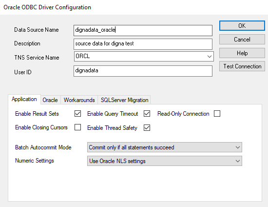
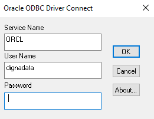
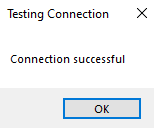

# Source Connector for Oracle

This guide describes how to configure Digna to connect to Oracle DB using either the native Python connector or the ODBC driver.

It refers to the screen **"Create a Database Connection"**.


---

## Native Python Driver

**Library:** `python-oracledb`  
**Supported Authentication:** Password-based authentication only

> ⚠️ For other authentication methods, please use the ODBC driver.

### Digna Configuration (Native Driver)

Provide the following information in the **"Create a Database Connection"** screen:

```
Technology:      Oracle
Host Address:    Server name or IP address
Host Port:       Port number, e.g. 1521
Database Name:   Instance name, service name
Schema Name:     Schema that contains the source data
User Name:       Database user name
User Password:   Password for the user
Use ODBC:        Disabled (default)
```

---

## ODBC Driver

The ODBC driver may support a broader range of authentication and connectivity options. This section focuses on password-based authentication using the driver **Oracle in OraDB21Home1**.

### 1. Install the ODBC Driver

Install the **Oracle in OraDB21Home1** (or similar) by following the vendor’s official installation guide.

### 2. Configure the ODBC Data Source

Follow these steps to configure a new ODBC data source using password-based authentication:

#### Step 1


Note:
The TNS Service Name must be configured in the tnsnames.ora file of your oracle client installation. This is where you provide the connection descriptor (host, port, service name).

#### Step 2 – Test the connection

Click the **Test Connection** button.



Provide the password and click **OK** button.



---

Now you can configure Digna to use the ODBC connection, either with a **DSN (Data Source Name)** or a **DSN-less** setup.

---

### A. DSN-Based Configuration

#### Digna Configuration

In the **"Create a Database Connection"** screen, provide the following:

```
Technology:      Oracle
Database Name:   Database that contains the source schema
Schema Name:     Schema that contains the source data
Use ODBC:        Enabled
```

#### ODBC Properties

```
name: "DSN",            value: "dignadata_oracle"
name: "UID",            value: "your oracle user"
name: "PWD",            value: "{your password in curly braces}"
```

> 🔹 The `DSN` must match the name defined in your ODBC driver configuration.

---

### B. DSN-less Configuration

#### Digna Configuration

In the **"Create a Database Connection"** screen, provide the following:

```
Technology:      Oracle
Database Name:   Schema that contains the source data (same as Schema Name)
Schema Name:     Schema that contains the source data
Use ODBC:        Enabled
```

#### ODBC Properties

```
name: "Driver",     value: "Oracle in OraDB21Home1"
name: "DBQ",        value: "(DESCRIPTION=(ADDRESS=(PROTOCOL=TCP)(HOST=localhost)(PORT=1521))(CONNECT_DATA=(SERVICE_NAME=XEPDB1)))"
name: "UID",        value: "your oracle user'
name: "PWD",        value: "your oracle password"
```
