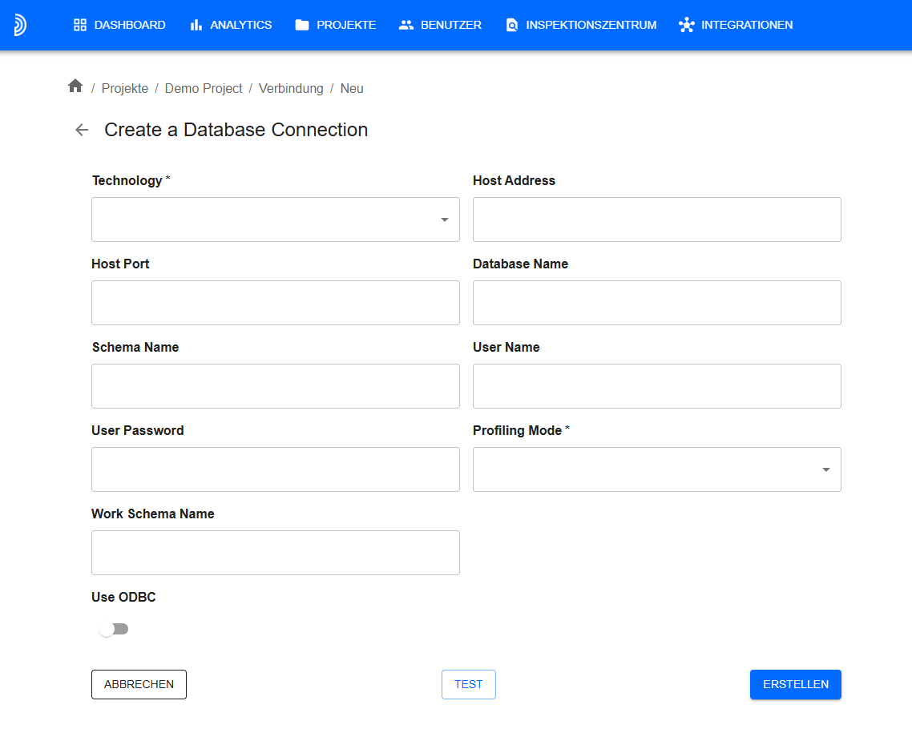
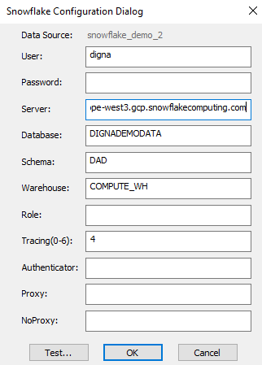
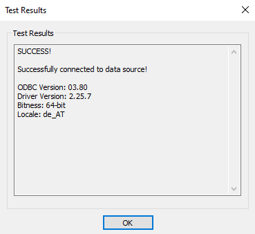

# Source Connector for Snowflake

This guide describes how to configure Digna to connect to Snowflake using either the native Python connector or the ODBC driver.

It refers to the screen **"Create a Database Connection"**.



---

## Native Python Driver

**Library:** `snowflake-connector-python`  
**Supported Authentication:** Password-based authentication only

> ⚠️ For other authentication methods, please use the ODBC driver.

### Digna Configuration (Native Driver)

Provide the following information in the **"Create a Database Connection"** screen:

```
Technology:      Snowflake
Host Address:    Snowflake account name
Host Port:       Not needed
Database Name:   Database that contains the source schema
Schema Name:     Schema that contains the source data
User Name:       User name and warehouse in the format "user<@>warehouse"
User Password:   Password for the user
Use ODBC:        Disabled (default)
```

---

## ODBC Driver

The ODBC driver may support a broader range of authentication and connectivity options. This section focuses on password-based authentication using the **SnowflakeDSIIDriver**.

### 1. Install the ODBC Driver

Install the **SnowflakeDSIIDriver** by following the vendor’s official installation guide.

### 2. Configure the ODBC Data Source

Follow these steps to configure a new ODBC data source using password-based authentication:

#### Step 1


Notes: 
- If you do not provide values for Database, Schema and Warehouse, then you will need to provide them as ODBC properties during the digna data source configuration.
- The value for "Server" consists of your snowflake account name followed by ".snowflakecomputing.com"

#### Step 2 – Test the connection

Click the **TEST** button. A successful connection should look like this:



---

Now you can configure Digna to use the ODBC connection, either with a **DSN (Data Source Name)** or a **DSN-less** setup.

---

### A. DSN-Based Configuration

#### Digna Configuration

In the **"Create a Database Connection"** screen, provide the following:

```
Technology:      Databricks
Database Name:   Database that contains the source schema
Schema Name:     Schema that contains the source data
Use ODBC:        Enabled
```

#### ODBC Properties

```
name: "DSN",            value: "snowflake_demo_2"
name: "PWD",            value: "{your password in curly braces}"

optionally:
name: "Database",       value: "Database that contains the source schema"
name: "Schema",         value: "Schema that contains the source data"
name: "Warehouse",      value: "Warehouse to use for the execution of the SQLs"


```

> 🔹 The `DSN` must match the name defined in your ODBC driver configuration.

---

### B. DSN-less Configuration

#### Digna Configuration

In the **"Create a Database Connection"** screen, provide the following:

```
Technology:      Databricks
Database Name:   Schema that contains the source data (same as Schema Name)
Schema Name:     Schema that contains the source data
Use ODBC:        Enabled
```

#### ODBC Properties

```
name: "Driver",     value: "{SnowflakeDSIIDriver}"
name: "Server",     value: "your-account-name.snowflakecomputing.com'
name: "UID",        value: "your snowflake user'
name: "PWD",        value: "your snowflake password"
name: "Database",   value: "Database that contains the source schema"
name: "Schema",     value: "Schema that contains the source data"
name: "Warehouse",  value: "Warehouse to use for the execution of the SQLs"
```
