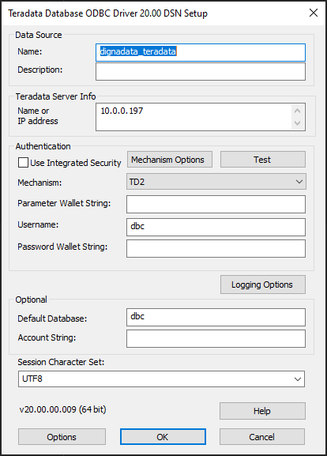
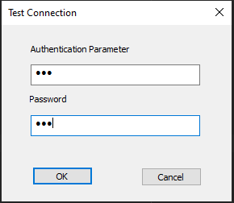

# Source Connector for Teradata

This guide describes how to configure Digna to connect to Teradata using either the native Python connector or the ODBC driver.

It refers to the screen **"Create a Database Connection"**.


---

## Native Python Driver

**Library:** `teradatasql`  
**Supported Authentication:** Password-based authentication only

> ⚠️ For other authentication methods, please use the ODBC driver.

### Digna Configuration (Native Driver)

Provide the following information in the **"Create a Database Connection"** screen:

```
Technology:      Teradata
Host Address:    Server name or IP address
Host Port:       Port number, e.g. 1025
Database Name:   Database name
Schema Name:     Database name
User Name:       Database user name
User Password:   Password for the user
Use ODBC:        Disabled (default)
```

---

## ODBC Driver

The ODBC driver may support a broader range of authentication and connectivity options. This section focuses on password-based authentication using the driver **Teradata Database ODBC Driver 20.00**.

### 1. Install the ODBC Driver

Install the driver **Teradata Database ODBC Driver 20.00** (or similar) by following the vendor’s official installation guide.

### 2. Configure the ODBC Data Source

Follow these steps to configure a new ODBC data source using password-based authentication:

#### Step 1


Click the **Test** button.

#### Step 2


Provide username and password.

Click the **OK** button.
When you receive the success screen, ODBC is configured properly.

---

Now you can configure Digna to use the ODBC connection, either with a **DSN (Data Source Name)** or a **DSN-less** setup.

---

### A. DSN-Based Configuration

#### Digna Configuration

In the **"Create a Database Connection"** screen, provide the following:

```
Technology:      Teradata
Database Name:   Database that contains the source schema
Schema Name:     Schema that contains the source data
Use ODBC:        Enabled
```

#### ODBC Properties

```
name: "DSN",        value: "dignadata_teradata"
name: "UID",        value: "your database user"
name: "PWD",        value: "your database password"
```

> 🔹 The `DSN` must match the name defined in your ODBC driver configuration.

---

### B. DSN-less Configuration

#### Digna Configuration

In the **"Create a Database Connection"** screen, provide the following:

```
Technology:      Teradata
Database Name:   Schema that contains the source data (same as Schema Name)
Schema Name:     Schema that contains the source data
Use ODBC:        Enabled
```

#### ODBC Properties

```
name: "DRIVER",     value: "Teradata Database ODBC Driver 20.00"
name: "DBCNAME",    value: "your server name or IP address"
name: "UID",        value: "your database user"
name: "PWD",        value: "your database password"
```
